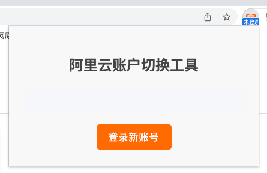
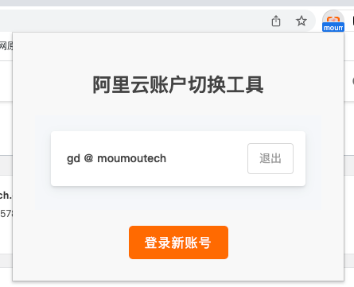
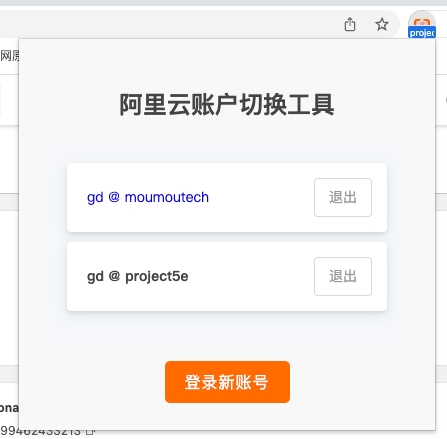

# Aliyun Account Switcher

Aliyun Account Switcher是一个 Chrome 插件，允许您轻松管理和切换多个Aliyun账号。

## 用法

如果您还没有登录任何账号，则初始界面如下所示：

### 录入新账号

- 当您已经登录时，单击插件图标将直接显示您当前登录的账号。

  

- 要添加新帐户，请单击“以新帐户登录”。这将带您进入到Aliyun子账号登录页面，可以继续登录到新帐户。登录成功后，再次单击插件图标将显示两个帐户。

  

  > “登录新账号”按钮 = 清除当前登录状态 + 跳转Aliyun子账号登录页。

### 切换账号

- 当前生效的账号以普通文本标识，缓存的账号以绿色可点击文本标识。单击要切换的帐户即可完成切换。

  > 切换账号时，将自动刷新所有域名为 *.aliyun.com 的页面。

### 退出账号

- 要退出帐户，请单击账号名称右侧的“退出”按钮。这将删除与该帐户相关的所有信息。

  > 如果退出当前活动的账号，也会触发阿里云页面刷新操作

### 关于Badge

为了显示当前生效的帐户，该插件以已登录帐户的企业别名或帐户名作为标记显示。这是一些示例：

- 如果已登录帐户为gd@moumoutech.com，则显示moumoutech.com。

  

- 如果已登录帐户为gd@187612896412.aliyun.com，则显示187612896412.aliyun.com。

Badge还有其他几个状态：

- 未登录：没有活动的账号。
  
  

- 已退出：您已退出账号，当前没有活动的账号。

  

- 已过期：活动的账号已过期。